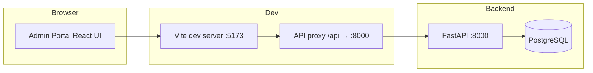

# Elysia Onboarding — Frontend Documentation

Product documentation for the **Onboarding Admin Portal** (React + Vite).

## Documents

| Document | Description |
|----------|-------------|
| [Admin portal guide](./admin-portal-guide.md) | Step-by-step usage for engineers onboarding brands |
| [Fields reference](./fields-reference.md) | Every field, format, validation rule, and enum value |

## Related documentation

Backend API, database schema, and migrations are documented in [`../../backend/docs/`](../backend/docs/README.md).

## Testing

Automated UI coverage is in `../test/` (Playwright).

Run from `frontend/`:

```bash
npx playwright install
npm run test:e2e
```

See [`../test/README.md`](../test/README.md) for full details, including the tracked field-name sequence used by tests.

## Quick links (in-app)

Open **Documentation** in the left sidebar (bottom) while running the admin portal locally.

## Architecture (frontend)



## Scope (current release)

| Included | Not included (yet) |
|----------|-------------------|
| Brand CRUD | API authentication |
| Onboarding config sections | Cognito provisioning |
| Metadata field mappings CRUD | S3 / KB automation |
| Integration placeholders (stored only) | Live AWS integrations |
