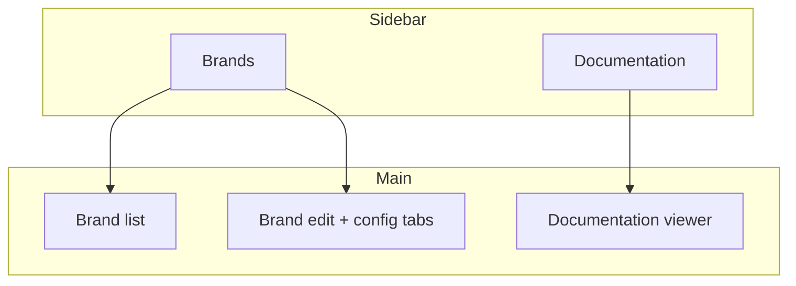
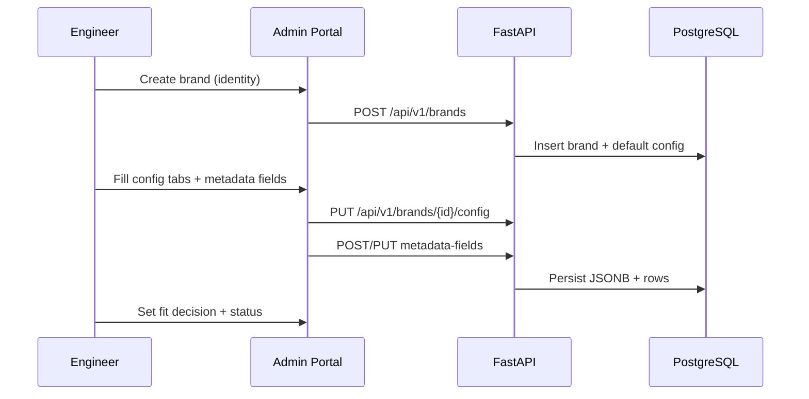

# Admin portal guide

How engineers use the **Elysia Onboarding Admin Portal** to capture Part 1 brand requirements and store them as structured configuration (Part 2 admin portal flow from Informa brand onboarding documentation).

## Who this is for

- Engineers provisioning a new Informa brand on the AI chat assistant platform
- Technical onboarding leads reviewing brand fit before go-live

## Before you start

1. **Backend** running at `http://127.0.0.1:8000` (`cd backend && .venv/bin/python run.py`)
2. **Frontend** running at `http://localhost:5173` (`cd frontend && npm run dev`)
3. PostgreSQL database `Elysia-onboarding` available (see backend docs)

## Portal layout

| Area | Purpose |
|------|---------|
| **Brands** | List all brands; create, edit, delete |
| **Documentation** (sidebar bottom) | In-app guides and field reference |
| **Brand identity** | Name, slug, app ID, fit decision, status |
| **Config tabs** | Branding, model, chat history, data source, metadata, upselling, integration placeholders |

### Hide Playwright test brands

Use the **Hide Playwright test brands** toggle in the top-right of the main area. When enabled (default), brands whose name starts with `Playwright Brand` or whose slug starts with `playwright-brand-` are hidden from the list. Turn it off to see and clean up automation leftovers. The preference is stored in your browser (`localStorage`).

## Workflow

### Step 1 — Create a brand

1. Go to **Brands** → **New brand**
2. Enter **Brand name** (display name)
3. **Slug** auto-fills from the name; edit if needed
   - Format: lowercase letters, numbers, hyphens only (`annual-review`, `technomic`)
4. Set **Fit decision** and **Status** (defaults: `not_ready`, `draft`)
5. Click **Create brand**

A new **`app_id`** (UUID) is generated automatically. This is the brand’s `elysiaAppId` for embed and API calls when integrations are wired.

### Step 2 — Complete config tabs

After creation, open each tab and click the section **Save** button. Tabs map to Part 1 onboarding topics:

| Tab | Onboarding doc topic |
|-----|----------------------|
| Branding & embed | Branding & frontend, UI Changes |
| Model | Model configuration |
| Chat history | Chat history |
| Data source | Data source & ingestion |
| Metadata fields | Metadata mappings (sidecars) |
| Upselling | Upselling modal |
| Integration (placeholders) | Part 2 automation references (not live) |

> **Tip:** You can save one section at a time. Unsaved changes in the current tab are lost if you navigate away without saving.

### Step 3 — Metadata field mappings

Use the **Metadata fields** tab when the brand defines custom document attributes:

1. Click **Add field mapping**
2. Enter **Brand field name** (human label from the brand, e.g. `Publication Date`)
3. Enter **Attribute key** in **camelCase** (e.g. `publicationTimestamp`) — used in `metadataAttributes` sidecars
4. Choose **Type**: `string`, `integer`, `boolean`, `string_array`
5. Mark **Required** / **Platform minimum** as agreed in Part 1
6. Set **Sort order** for display order in the table

### Step 4 — Fit decision and status

| Fit decision | When to use |
|--------------|-------------|
| `not_ready` | Part 1 incomplete |
| `standard` | Config-only onboarding; platform docs apply as-is |
| `custom` | Custom integration, model, history, data path, or upsell work |

| Status | When to use |
|--------|-------------|
| `draft` | Work in progress |
| `in_review` | Ready for engineering review |
| `active` | Live or ready for automation handoff |
| `archived` | Decommissioned / historical |

Update these on the **Brand identity** card and click **Save identity**.

### Step 5 — Delete a brand

From the brand edit page, **Delete brand** removes the brand, its config, and all metadata field rows (cascade). This cannot be undone.

## What is stored vs wired

| Stored in DB | Wired to AWS / live services |
|--------------|------------------------------|
| Embed URLs, widget colors | CDN deploy |
| Model choice, notes | Bedrock / model routing |
| Chat retention policy | History store |
| S3 bucket/prefix (placeholder) | Actual S3 buckets |
| Cognito client IDs (placeholder) | Cognito app clients |
| KB id/name (placeholder) | Knowledge base creation |

## Troubleshooting

| Issue | Check |
|-------|--------|
| Cannot load brands | Backend running? Database reachable? |
| `slug already exists` | Pick a unique slug |
| `attribute_key must be camelCase` | Key must start with lowercase letter |
| Save config fails | Brand must be created first (not on `/brands/new`) |

## See also

- [Fields reference](./fields-reference.md) — formats and validation
- [Backend API reference](../../backend/docs/api-reference.md)
- [Backend data model](../../backend/docs/data-model.md)
