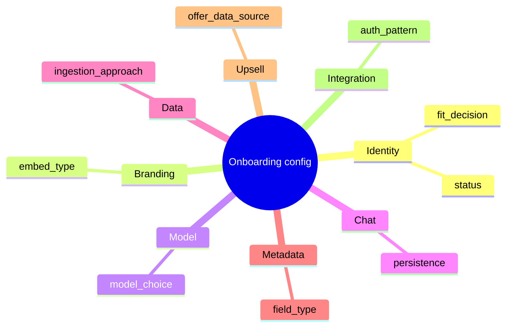

# Fields reference

Complete reference for every field in the admin portal: required vs optional, formats, and allowed values.

## Brand identity

| Field | Required | Format | Notes |
|-------|----------|--------|-------|
| **Brand name** | Yes | 1–255 characters | Display name |
| **Slug** | Yes | `^[a-z0-9]+(?:-[a-z0-9]+)*$` | Unique URL-safe id, e.g. `annual-review` |
| **App ID** | Auto | UUID v4 | Generated on create; maps to `elysiaAppId` / `app_id` in APIs |
| **Fit decision** | Yes | Enum | `not_ready`, `standard`, `custom` |
| **Status** | Yes | Enum | `draft`, `in_review`, `active`, `archived` |
| **Notes** | No | Free text | Internal engineering notes |

## Branding & embed

| Field | Required | Format | Notes |
|-------|----------|--------|-------|
| **Embed type** | Yes | Enum | `cdn`, `npm`, `iframe` |
| **CDN widget script URL** | If CDN | URL string | Production `<script src="...">` |
| **npm package name** | If npm | Package string | e.g. `@informa/elysia-widget` |
| **iframe chat host URL** | If iframe | URL string | iframe `src` |
| **Design notes** | No | Text | CSS / design system notes |
| **Show launcher button** | Yes | Boolean | `isButtonDisplayed` in embed |
| **Persona selection enabled** | Yes | Boolean | `isPersonaSelectionEnabled` |
| **Widget → headerTitle** | No | String | Chat header label |
| **Widget → welcomeMessage** | No | String | First message in widget |
| **Widget → inputPlaceholder** | No | String | Input hint |
| **Widget → disclaimer** | No | String | Legal disclaimer text |
| **Widget → *Gradient / border colors** | No | CSS color | Hex strings, e.g. `#3eb8b8` |
| **Widget → logoUrl** | No | URL or empty | Nullable |
| **Widget → bodyBackgroundImageUrl** | No | URL or empty | Nullable |

## Model configuration

| Field | Required | Format | Notes |
|-------|----------|--------|-------|
| **Model choice** | Yes | Enum | `platform_default`, `custom` |
| **Model ID / name** | If custom | String | Provider model id when not platform default |
| **Notes** | No | Text | Compliance, latency, budget notes |

## Chat history

| Field | Required | Format | Notes |
|-------|----------|--------|-------|
| **Persistence** | Yes | Enum | `session_only`, `persisted` |
| **Retention (days)** | If persisted | Integer ≥ 0 or empty | Empty = not set |
| **Use user_id in metadata** | Yes | Boolean | For persisted history |
| **Notes** | No | Text | Retention agreements with brand |

## Data source

| Field | Required | Format | Notes |
|-------|----------|--------|-------|
| **Ingestion approach** | Yes | Enum | `ingestion_api`, `brand_s3_push` (config only) |
| **Formats** | No | Comma-separated list | e.g. `PDF, CSV, JSON` → stored as array |
| **Max file size (MB)** | Yes | Integer | Default `50` per platform ingestion doc |
| **Source systems notes** | No | Text | Where brand data lives today |
| **Metadata creation mechanism** | No | Text | CMS, spreadsheet, manual, assisted |
| **Metadata ownership** | No | String | Who approves sidecars |
| **Metadata scope** | No | String | Which content types get metadata |

## Metadata field mapping (per row)

| Field | Required | Format | Notes |
|-------|----------|--------|-------|
| **Brand field name** | Yes | String | Human-readable label from brand |
| **Attribute key** | Yes | camelCase string | Must start with lowercase; maps to `metadataAttributes` |
| **Type** | Yes | Enum | `string`, `integer`, `boolean`, `string_array` |
| **Description** | No | Text | Meaning of the field |
| **Required** | Yes | Boolean | Must appear in every sidecar |
| **Platform minimum** | Yes | Boolean | Required for retrieval/filters |
| **Sort order** | No | Integer | Table ordering (default `0`) |

### Sidecar value rules (platform)

When metadata is used in ingestion (future automation), sidecar values must follow platform rules:

- Keys: **camelCase** only
- Values: strings, integers, booleans, or string arrays
- No empty strings, nulls, or empty arrays

## Upselling modal

| Field | Required | Format | Notes |
|-------|----------|--------|-------|
| **Upselling enabled** | Yes | Boolean | |
| **Modal copy** | If enabled | Text | Body copy |
| **CTA text** | No | String | Button label |
| **Business rules** | No | Text | Who sees modal, when |
| **Offer data source** | Yes | Enum | `static`, `api` |
| **Compliance notes** | No | Text | Regional/legal review |

## Integration placeholders

Stored for Part 2 handoff; **not connected** to AWS in this release.

| Field | Format | Maps to (when integrated) |
|-------|--------|---------------------------|
| **Auth pattern** | `wrapper`, `direct_oauth` | Token flow |
| **Cognito pool domain** | URL host | OAuth token endpoint |
| **Cognito client ID** | String | App client |
| **Client secret reference** | String | Secret manager ref (not raw secret) |
| **S3 bucket** | String | Brand content bucket |
| **S3 prefix** | String | Object prefix |
| **Collection name** | String | Ingestion API `collection_name` |
| **Knowledge base ID** | String | Bedrock KB id |
| **Knowledge base name** | String | Display / ops name |
| **Query builder notes** | Text | Brand-specific retrieval logic |
| **Brand prompts** | Text | System / pre-populated prompts |

## Enum quick reference

## API field names (JSON)

Frontend form labels map to API / database JSON keys:

| UI section | API key (PUT `/brands/{id}/config`) |
|------------|-------------------------------------|
| Branding & embed | `branding` |
| Model | `model_settings` |
| Chat history | `chat_history` |
| Data source | `data_source` |
| Upselling | `upselling` |
| Integration | `integration` |

Metadata rows use `/brands/{id}/metadata-fields` with keys matching the table above.
